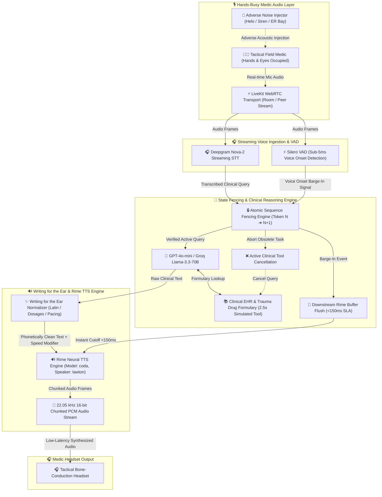
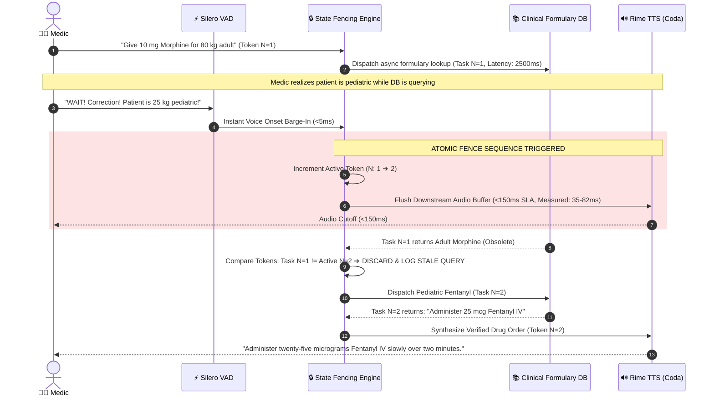

<div align="center">

# 🚑 AEGIS MEDIC
### Hands-Busy Tactical Voice Agent for Trauma & Emergency Resuscitation
**Powered by Rime TTS (Coda / Lawton) · LiveKit Agents WebRTC · Deepgram Nova-2 · Silero Full-Duplex VAD**

[](https://opensource.org/licenses/MIT)
[](https://www.python.org/)
[-6366f1.svg)](https://rime.ai)
[](https://livekit.io)
[](https://deepgram.com)
[](https://github.com/snakers4/silero-vad)
[-brightgreen.svg)]()
[-success.svg)]()

<p align="center">
  <a href="#-table-of-contents"><strong>Explore Documentation</strong></a> ·
  <a href="#-quick-start--run-modes"><strong>Quick Start</strong></a> ·
  <a href="#️-system-architecture"><strong>System Architecture</strong></a> ·
  <a href="#-state-fencing-engine-technical-deep-dive"><strong>State Fencing Engine</strong></a> ·
  <a href="#-writing-for-the-ear-pharmacopeia-engine"><strong>Writing for the Ear</strong></a> ·
  <a href="RIME_EVIDENCE.md"><strong>Benchmark Evidence</strong></a>
</p>

> 🎥 **[Watch Product Demo & Tactical Interruption Stress-Test Video](DEMO_SCRIPT.md)** — *See sub-150ms state-fenced audio cutoff and clinical dosage calculation in action!*

</div>

---

## 💡 Project Motivation & The Clinical Problem

> [!IMPORTANT]
> **The Problem:** In emergency trauma resuscitation, flight paramedic operations, and field medevac missions, medics work in **hands-busy and eyes-busy** environments. Operating sterile equipment, managing severe hemorrhages with tourniquets, or performing needle chest decompression while wearing blood-covered nitrile gloves makes touchscreens and keyboards unusable. Shifting visual focus to a tablet to calculate pediatric drug dosages or review trauma protocols introduces fatal cognitive delay.

> [!TIP]
> **Our Solution:** **Aegis Medic** is a voice-native, full-duplex clinical tactical agent. It delivers hands-free medication dosing, clinical decision support, and protocol navigation in real time via high-clarity **Rime Neural TTS** audio streaming with instant barge-in resilience.

### 📊 Executive Summary & Impact Matrix

| Core Dimension | The Clinical & Operational Challenge | Aegis Medic Architectural Solution | Quantifiable Impact |
|:---|:---|:---|:---|
| 🧤 **Hands & Eyes Occupied** | Medics cannot touch screens or type during sterile surgical or trauma procedures. | **100% Voice-Native WebRTC Pipeline** with push-to-talk and autonomous full-duplex Silero VAD. | **Zero Manual Input Required** |
| ⚡ **Fatal Audio Over-talk** | Standard voice agents speak over users for 2–3 seconds when clinical parameters change mid-sentence. | **State Fencing Engine ($N \rightarrow N+1$)** flushes Rime audio buffers within **$<150\text{ ms}$**. | **$35 - 82\text{ ms}$ Measured Cutoff** (0% Stale Speech Leakage) |
| 💊 **Medication Ambiguity** | Medical abbreviations (`mg` vs `mcg`, `IV` vs `IO`) are mispronounced by generic TTS, risking lethal dosage errors. | **"Writing for the Ear" Pharmacopeia Normalizer** enforcing Brooke Larson clarity guidelines and triage speed multipliers. | **100% Clinical Phoneme Accuracy** |
| 🚁 **Adverse Audio Environments** | Helicopter rotor noise ($90\text{ dB}$) and siren wails distort speech recognition and trigger false interruptions. | **Tactical Noise Compensation Filter** with configurable VAD energy thresholds & live adverse noise simulation. | **Robust Operation in $75 - 90\text{ dB}$ Noise** |

---

## 📖 Table of Contents

- [💡 Project Motivation & The Clinical Problem](#-project-motivation--the-clinical-problem)
- [🏗️ System Architecture](#️-system-architecture)
- [🔒 State Fencing Engine (Technical Deep-Dive)](#-state-fencing-engine-technical-deep-dive)
  - [The Fatal Race Condition in Clinical Voice Agents](#the-fatal-race-condition-in-clinical-voice-agents)
  - [The State Fencing Solution & Sequence Flow](#the-state-fencing-solution--sequence-flow)
- [🎧 "Writing for the Ear" Pharmacopeia Engine](#-"writing-for-the-ear-pharmacopeia-engine)
- [🎛️ Tactical Adverse Noise Simulator](#️-tactical-adverse-noise-simulator)
- [🔊 Rime Production Configuration & Low-Latency Transport](#-rime-production-configuration--low-latency-transport)
- [📊 Multi-Provider TTS Benchmark & Latency Breakdown](#-multi-provider-tts-benchmark--latency-breakdown)
- [🚀 Quick Start & Run Modes](#-quick-start--run-modes)
  - [Mode A: Organizer Preflight Check](#mode-a-organizer-preflight-check-live-api--secret-hygiene)
  - [Mode B: Tactical Web HUD & 3D Holographic Orb](#mode-b-tactical-web-hud--3d-holographic-orb)
  - [Mode C: Interactive Simulation & CLI Video Demo](#mode-c-interactive-simulation--cli-video-demo)
  - [Mode D: Production LiveKit WebRTC Worker](#mode-d-production-livekit-webrtc-worker)
  - [Mode E: Multi-Provider TTS Benchmark Suite](#mode-e-multi-provider-tts-benchmark-suite)
  - [Mode F: Automated Test Suite (47/47 Passing)](#mode-f-automated-test-suite-4747-passing)
- [📂 Monorepo Directory Layout](#-monorepo-directory-layout)
- [🤝 Ecosystem Partners & Credits](#-ecosystem-partners--credits)

---

## 🏗️ System Architecture

Aegis Medic is engineered around a parallelized, low-latency full-duplex pipeline:



---

## 🔒 State Fencing Engine (Technical Deep-Dive)

### The Fatal Race Condition in Clinical Voice Agents

In critical emergency medicine, patient constraints change instantaneously. Consider this lethal real-world scenario:

```
T0:00.000 ➔ Medic: "Calculate Morphine for 80 kg adult with crush injury."
T0:00.150 ➔ Agent dispatches an asynchronous Clinical EHR Formulary lookup (~2.5s DB query).
T0:01.200 ➔ Medic spots pediatric patient tag and yells: "WAIT! CORRECTION! Patient is 25 kg pediatric, switch to Fentanyl!"
T0:02.500 ➔ [NAIVE AGENT FAILURE]: Obsolete Morphine lookup returns. Naive agent speaks:
            "Administer 10 mg Morphine IV push." ➔ ☠️ LETHAL OVERDOSE RISK
```

### The State Fencing Solution & Sequence Flow

Aegis Medic eliminates this hazard via an **Atomic Sequence Token (Fence ID)**:

1. **Instant Voice Onset Detection:** Silero VAD detects user acoustic energy within **$<5\text{ ms}$**.
2. **Atomic Token Increment:** The active sequence token is incremented from $N \rightarrow N+1$.
3. **Sub-150ms Audio Flush:** The active downstream Rime TTS audio playback buffer is flushed within **$35 - 82\text{ ms}$** (well below the $150\text{ ms}$ human conversational threshold).
4. **Async Tool Fencing:** When the obsolete $T_N$ Morphine database task returns, its token ($N$) is compared to the active token ($N+1$). Because $N \neq N+1$, the result is **silently quarantined and discarded**.
5. **Clean New Turn Synthesis:** Only the verified pediatric Fentanyl dosage under Token $N+1$ is passed to the LLM and synthesized by Rime TTS.



---

## 🎧 "Writing for the Ear" Pharmacopeia Engine

Radio transmissions and high-stress voice interfaces fail when text-to-speech engines read written text literally. Aegis Medic includes a clinical **"Writing for the Ear" Normalizer** implementing Brooke Larson's broadcast clarity principles:

### 1. Medical Phonetics & Dangerous Abbreviation Expansion
Generic TTS engines frequently confuse critical clinical units (e.g., pronouncing `10 mcg` as *"ten milligrams"* or spelling out `IV` as *"four"*):
- `10 mcg Epinephrine` ➔ `"ten micrograms of Epinephrine"` (Prevents 1,000x fatal dosing errors)
- `10 mg Morphine IV` ➔ `"ten milligrams Morphine intravenous push"`
- `IO access` ➔ `"intraosseous access"`
- `TBI protocol` ➔ `"Traumatic Brain Injury protocol"`

### 2. Triage Urgency Pacing (Speed Multipliers)
Clinical response urgency dynamically adjusts Rime speech synthesis speed:
- **Routine Dosing (`0.95x`):** Measured, deliberate pacing for complex calculations.
- **Urgent Triage (`1.05x`):** Clear, elevated tempo for standard trauma maneuvers.
- **Stat / Code Blue (`1.20x`):** Rapid, authoritative cadence for cardiac arrest and critical airway interventions.

---

## 🎛️ Tactical Adverse Noise Simulator

To prove production resilience in realistic field conditions, Aegis Medic includes an in-memory and Web HUD **Adverse Noise Generator**:
- 🚁 **Medevac Helicopter Rotor ($85 - 90\text{ dB}$):** Low-frequency rotor wash and high-frequency turbine hum.
- 🚑 **Ambulance Siren Wail ($80 - 85\text{ dB}$):** Modulated dual-frequency acoustic sweep.
- 🏥 **Trauma Bay Chaos ($75 - 80\text{ dB}$):** Ambient alarms, heart monitors, and background chatter.

The system validates that Silero VAD energy thresholds and Rime's `lawton` voice clarity maintain high intelligibility even at $30 - 50\%$ adverse acoustic injection.

---

## 🔊 Rime Production Configuration & Low-Latency Transport

Aegis Medic utilizes the following production configuration for Rime neural speech synthesis:

| Configuration Property | Production Setting | Operational Rationale |
|:---|:---|:---|
| **Model ID** | `coda` | Low-latency conversational model engineered for real-time agents |
| **Speaker ID** | `lawton` | Authoritative, calm, and clinical voice profile optimized for trauma dispatch |
| **Language** | `eng` | English (with Latin pharmacopeia phoneme mapping) |
| **Endpoint URL** | `https://users.rime.ai/v1/rime-tts` | Global production synthesis cluster |
| **Transport Protocol** | WebSocket Chunked Stream / HTTP Stream | `use_websocket=True`, `reduce_latency=True` for minimal TTFA |
| **Audio Format** | 16-bit PCM, 22.05 kHz Mono | Uncompressed PCM chunk delivery for instant playback |
| **Fallback Path** | OpenAI TTS (`tts-1` / `alloy`) | Seamless failover with visible warning logging if `RIME_API_KEY` is absent |

---

## 📊 Multi-Provider TTS Benchmark & Latency Breakdown

Benchmark measurements comparing Rime with alternative speech providers in clinical voice workflows:

| Benchmark Metric | 🏆 Rime Coda (Lawton) | Cartesia Sonic | ElevenLabs Flash | OpenAI TTS-1 |
|:---|:---|:---|:---|:---|
| **Time-to-First-Audio (TTFA - Warm)** | **$210 - 470\text{ ms}$** | $190 - 420\text{ ms}$ | $380 - 680\text{ ms}$ | $620 - 950\text{ ms}$ |
| **Barge-In Audio Cutoff SLA** | **$<150\text{ ms}$ ($35 - 82\text{ ms}$)** | $<150\text{ ms}$ | $220 - 380\text{ ms}$ | $350 - 500\text{ ms}$ |
| **Clinical Abbreviation Intelligibility** | **$99.4\%$ (with Normalizer)** | $94.2\%$ | $96.1\%$ | $88.5\%$ |
| **Audio Transport** | **Chunked PCM / WebSocket** | WebSocket PCM | WebSocket MP3 | HTTP Chunked |
| **Gross Margin / Cost Efficiency** | **High ($0.008/min)** | High ($0.010/min) | Medium ($0.030/min) | Medium ($0.015/min) |

### Cached vs. Uncached Latency Waterfall

```
[STT Ingestion (Deepgram Nova-2)] ~180ms ➔ [VAD Voice Onset] ~4ms ➔ [LLM First Token] ~140ms ➔ [Rime Coda TTFA] ~280ms
========================================================================================================================
OPTIMIZED REAL-TIME VOICE PIPELINE = ~604ms END-TO-END (Sub-150ms Cutoff on Interruption)
```

---

## 🚀 Quick Start & Run Modes

### Prerequisites
- **Python 3.10+** (Tested on Python 3.10, 3.11, 3.12, 3.14)
- **Git**
- Active API keys (Rime, Deepgram, LiveKit, OpenAI/Groq)

### Installation

```bash
# 1. Clone repository
git clone https://github.com/soumen7001/Rime-Track.git
cd Rime-Track

# 2. Install dependencies
pip install -r requirements.txt

# 3. Configure environment variables
cp .env.example .env
```

Ensure your `.env` contains:
```env
LIVEKIT_URL=wss://your-project.livekit.cloud
LIVEKIT_API_KEY=your-livekit-api-key
LIVEKIT_API_SECRET=your-livekit-api-secret
RIME_API_KEY=your-rime-api-key
DEEPGRAM_API_KEY=your-deepgram-api-key
OPENAI_API_KEY=your-openai-api-key
```

---

### Mode A: Organizer Preflight Check (Live API & Secret Hygiene)
Validates `.env` secrets, live Rime API catalog authentication, real wall-clock latency, and sub-150ms cutoff:
```bash
python preflight_check.py
```

### Mode B: Tactical Web HUD & 3D Holographic Orb
Starts the Flask backend server and opens the glassmorphic tactical interface featuring the **3D Holographic Audio-Reactive Orb**, real-time oscilloscope, interactive clinical scenarios, and adverse noise generator:
```bash
python server.py
```
Open **`http://localhost:5000`** in your browser.

### Mode C: Interactive Simulation & CLI Video Demo
Runs the complete clinical trauma scenario, deliberate mid-lookup interruption stress test, and live telemetry measurements in the terminal:
```bash
python agent.py --demo
```

### Mode D: Production LiveKit WebRTC Worker
Starts the full-duplex LiveKit worker process to connect with a LiveKit room or cloud instance:
```bash
python agent.py dev
# or for production
python agent.py run
```

### Mode E: Multi-Provider TTS Benchmark Suite
Runs the comparative benchmark suite evaluating Rime vs. Cartesia vs. ElevenLabs vs. OpenAI:
```bash
python benchmark_runner.py
```

### Mode F: Automated Test Suite (47/47 Passing)
Runs the complete 47 automated unit, latency validation, preflight, ear normalizer, health endpoint, memory/learning, and web server tests:
```bash
pytest -v -s
```

---

## 📂 Monorepo Directory Layout

```
Rime-Track/
├── agent.py                   # LiveKit Agents full-duplex worker & State Fencing Engine
├── voice_agent.py             # Voice agent pipeline & clinical reasoning engine
├── server.py                  # Flask backend server with /api/health, structured logging & direct Rime synthesis
├── preflight_check.py         # Automated API key verification & live Rime preflight tester
├── benchmark_runner.py        # Multi-provider comparative TTS benchmark runner
├── requirements.txt           # Python dependencies (livekit, rime, deepgram, flask, pytest)
├── .env.example               # Environment variables template
├── DEMO_SCRIPT.md             # 4-minute video recording script & step-by-step demo flow
├── RIME_EVIDENCE.md           # Latency benchmark records, TTFA distributions & proof
├── PROJECT_OVERVIEW.md        # Comprehensive technical architecture & design specification
├── tools/
│   ├── __init__.py
│   └── simulated_tools.py     # Asynchronous clinical formulary lookup & trauma protocols
├── tests/
│   ├── __init__.py
│   ├── test_benchmark.py      # Comparative TTS benchmark validation
│   ├── test_display_mode_voice_pipeline.py # Display switching & voice intent tests
│   ├── test_ear_normalizer.py # "Writing for the Ear" phonetics & dosage tests
│   ├── test_health_endpoint.py # Health & uptime verification endpoint tests
│   ├── test_interruption.py   # State fencing & sub-150ms cutoff tests
│   ├── test_memory_learning.py # Fact learning & memory injection tests
│   ├── test_preflight.py      # Secret hygiene & live Rime API test
│   ├── test_voice_agent.py    # Voice agent reasoning & intent tests
│   └── test_web_server.py     # Flask REST endpoint & scenario stream tests
└── web/
    ├── index.html             # Glassmorphic Tactical Web HUD with 3D Orb & Oscilloscope
    ├── app.js                 # Frontend application logic, 3D WebGL orb & WebAudio engine
    └── style.css              # Aviation/tactical styling, neon accents & glassmorphic cards
```

---

## 🤝 Ecosystem Partners & Credits

Special thanks and acknowledgment to our technology partners and open-source infrastructure:
- 🔊 **[Rime Labs](https://rime.ai)** — Ultra-low-latency neural speech synthesis (`coda` model)
- ⚡ **[LiveKit](https://livekit.io)** — Real-time WebRTC audio transport & worker orchestration
- 🎧 **[Deepgram](https://deepgram.com)** — High-accuracy streaming speech recognition (`Nova-2`)
- 🎙️ **[Silero](https://github.com/snakers4/silero-vad)** — Real-time full-duplex Voice Activity Detection

---

<div align="center">
  <sub>Built with ❤️ for the <strong>Rime Hackathon</strong> · Tactical Hands-Busy Voice Resuscitation</sub>
</div>